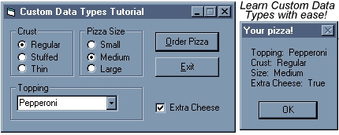

<div align="center">

## Custom Data Type Tutorial \- 1


</div>

### Description

Please vote! I wrote this in a few (like 5) hours, so please vote! Thank you!
 
### More Info
 


<span>             |<span>
---                |---
**Submitted On**   |2003-01-02 14:46:20
**By**             |[Paul Zaczkowski](https://github.com/Planet-Source-Code/PSCIndex/blob/master/ByAuthor/paul-zaczkowski.md)
**Level**          |Beginner
**User Rating**    |4.2 (25 globes from 6 users)
**Compatibility**  |VB 5\.0, VB 6\.0
**Category**       |[Coding Standards](https://github.com/Planet-Source-Code/PSCIndex/blob/master/ByCategory/coding-standards__1-43.md)
**World**          |[Visual Basic](https://github.com/Planet-Source-Code/PSCIndex/blob/master/ByWorld/visual-basic.md)
**Archive File**   |[Custom\_Dat152257122003\.zip](https://github.com/Planet-Source-Code/paul-zaczkowski-custom-data-type-tutorial-1__1-42108/archive/master.zip)


### Source Code

```
<html xmlns:v="urn:schemas-microsoft-com:vml"
xmlns:o="urn:schemas-microsoft-com:office:office"
xmlns:w="urn:schemas-microsoft-com:office:word"
xmlns="http://www.w3.org/TR/REC-html40">
<head>
<meta http-equiv=Content-Type content="text/html; charset=windows-1252">
<meta name=ProgId content=Word.Document>
<meta name=Generator content="Microsoft Word 9">
<meta name=Originator content="Microsoft Word 9">
<link rel=File-List
href="./Custom%20Data%20Types%20Tutorial%201_files/filelist.xml">
<title>Custom Data Types Tutorial</title>
<!--[if gte mso 9]><xml>
 <o:DocumentProperties>
 <o:Author>Michael Craigen</o:Author>
 <o:Template>Normal</o:Template>
 <o:LastAuthor>Michael Craigen</o:LastAuthor>
 <o:Revision>16</o:Revision>
 <o:TotalTime>213</o:TotalTime>
 <o:LastPrinted>2003-01-02T19:26:00Z</o:LastPrinted>
 <o:Created>2003-01-02T20:24:00Z</o:Created>
 <o:LastSaved>2003-01-02T20:40:00Z</o:LastSaved>
 <o:Pages>3</o:Pages>
 <o:Words>812</o:Words>
 <o:Characters>4630</o:Characters>
 <o:Company> </o:Company>
 <o:Lines>38</o:Lines>
 <o:Paragraphs>9</o:Paragraphs>
 <o:CharactersWithSpaces>5685</o:CharactersWithSpaces>
 <o:Version>9.2720</o:Version>
 </o:DocumentProperties>
</xml><![endif]--><!--[if gte mso 9]><xml>
 <w:WordDocument>
 <w:Zoom>120</w:Zoom>
 <w:HideSpellingErrors/>
 <w:HideGrammaticalErrors/>
 <w:ActiveWritingStyle Lang="EN-US" VendorID="64" DLLVersion="131077"
  NLCheck="1">1</w:ActiveWritingStyle>
 </w:WordDocument>
</xml><![endif]-->
<style>
<!--
 /* Style Definitions */
p.MsoNormal, li.MsoNormal, div.MsoNormal
	{mso-style-parent:"";
	margin:0in;
	margin-bottom:.0001pt;
	mso-pagination:widow-orphan;
	font-size:12.0pt;
	font-family:"Times New Roman";
	mso-fareast-font-family:"Times New Roman";}
h1
	{mso-style-next:Normal;
	margin:0in;
	margin-bottom:.0001pt;
	text-align:center;
	mso-pagination:widow-orphan;
	page-break-after:avoid;
	mso-outline-level:1;
	font-size:12.0pt;
	font-family:Arial;
	mso-font-kerning:0pt;
	font-weight:bold;}
h2
	{mso-style-next:Normal;
	margin-top:0in;
	margin-right:0in;
	margin-bottom:0in;
	margin-left:.25in;
	margin-bottom:.0001pt;
	mso-pagination:widow-orphan;
	page-break-after:avoid;
	mso-outline-level:2;
	font-size:12.0pt;
	font-family:Arial;
	font-weight:bold;
	text-decoration:underline;
	text-underline:single;}
h3
	{mso-style-next:Normal;
	margin:0in;
	margin-bottom:.0001pt;
	mso-pagination:widow-orphan;
	page-break-after:avoid;
	mso-outline-level:3;
	font-size:12.0pt;
	font-family:Arial;
	font-weight:bold;
	text-decoration:underline;
	text-underline:single;}
h4
	{mso-style-next:Normal;
	margin:0in;
	margin-bottom:.0001pt;
	mso-pagination:widow-orphan;
	page-break-after:avoid;
	mso-outline-level:4;
	font-size:10.0pt;
	mso-bidi-font-size:12.0pt;
	font-family:Arial;
	font-weight:bold;}
p.MsoTitle, li.MsoTitle, div.MsoTitle
	{margin:0in;
	margin-bottom:.0001pt;
	text-align:center;
	mso-pagination:widow-orphan;
	font-size:18.0pt;
	mso-bidi-font-size:12.0pt;
	font-family:Arial;
	mso-fareast-font-family:"Times New Roman";
	font-weight:bold;}
p.MsoBodyTextIndent, li.MsoBodyTextIndent, div.MsoBodyTextIndent
	{margin:0in;
	margin-bottom:.0001pt;
	text-indent:.5in;
	mso-pagination:widow-orphan;
	font-size:12.0pt;
	font-family:Arial;
	mso-fareast-font-family:"Times New Roman";}
p
	{margin-right:0in;
	mso-margin-top-alt:auto;
	mso-margin-bottom-alt:auto;
	margin-left:0in;
	mso-pagination:widow-orphan;
	font-size:12.0pt;
	font-family:"Times New Roman";
	mso-fareast-font-family:"Times New Roman";}
@page Section1
	{size:8.5in 11.0in;
	margin:1.0in 1.25in 1.0in 1.25in;
	mso-header-margin:.5in;
	mso-footer-margin:.5in;
	mso-paper-source:0;}
div.Section1
	{page:Section1;}
-->
</style>
</head>
<body lang=EN-US style='tab-interval:.5in'>
<div class=Section1>
<p class=MsoTitle><u><span style='font-weight:normal'>Custom Data Types
Tutorial Part 1<o:p></o:p></span></u></p>
<p class=MsoNormal align=center style='text-align:center'><span
style='font-family:Arial'><![if !supportEmptyParas]>&nbsp;<![endif]><o:p></o:p></span></p>
<h1><span style='font-family:"Times New Roman"'>A Beginners Introduction to
Custom Data Types<o:p></o:p></span></h1>
<p class=MsoNormal align=center style='text-align:center'><b>Paul Zaczkowski</b><span
style='font-family:Arial'><o:p></o:p></span></p>
<p class=MsoNormal><span style='font-family:Arial'><![if !supportEmptyParas]>&nbsp;<![endif]><o:p></o:p></span></p>
<h3>Introduction</h3>
<p class=MsoNormal><span style='font-family:Arial'><span style='mso-tab-count:
1'>               </span><o:p></o:p></span></p>
<p class=MsoNormal><span style='font-family:Arial'><span style='mso-tab-count:
1'>               </span>Hello and welcome to my ‘Custom Data Type’
tutorial.<span style="mso-spacerun: yes">  </span>This tutorial is for anyone
wanting to know about Custom Data Types.<span style="mso-spacerun: yes"> 
</span>I personally went a long time, completely unaware of what a data type
even was, but now that I know, they have proven to be very useful.<span
style="mso-spacerun: yes">  </span>Enjoy! (BTW, a type is used in declarations
like: Dim iNumber As <b>Integer</b>.<span style="mso-spacerun: yes"> 
</span>The type here is integer)<o:p></o:p></span></p>
<p class=MsoNormal><span style='font-family:Arial'><![if !supportEmptyParas]>&nbsp;<![endif]><o:p></o:p></span></p>
<p class=MsoNormal><b><u><span style='font-family:Arial'>Chapter 1 -<span
style="mso-spacerun: yes">  </span>What is a Custom Data Type?<o:p></o:p></span></u></b></p>
<p class=MsoNormal><span style='font-family:Arial'><![if !supportEmptyParas]>&nbsp;<![endif]><o:p></o:p></span></p>
<p class=MsoNormal><span style='font-family:Arial'><span style='mso-tab-count:
1'>               </span>If you have ever worked with C or C++, then you may
have heard the term structure.<span style="mso-spacerun: yes">  </span>Since I
have barely worked with C++, I have never heard that term.<span
style="mso-spacerun: yes">  </span>Anyways, a ‘Custom Data Type’ (CDT) is
simply the combination of a finite number of variables, with different data
types, stored in an variable name.<span style="mso-spacerun: yes">   </span>Not
sure what I mean (<i>I am not sure I am either</i>)?<o:p></o:p></span></p>
<p class=MsoNormal><span style='font-family:Arial'><![if !supportEmptyParas]>&nbsp;<![endif]><o:p></o:p></span></p>
<p class=MsoNormal><span style='font-family:Arial'><span style='mso-tab-count:
1'>               </span>Well, let’s say you’re going to bake a pizza.<span
style="mso-spacerun: yes">  </span>On a pizza, you have many different
entities, or <i>variables</i>.<span style="mso-spacerun: yes">  </span>You
have:<span style="mso-spacerun: yes">  </span>toppings, crust, extra cheese or
not, and size (Large, Medium, &amp; Small).<span style="mso-spacerun: yes"> 
</span>With this information, you can create a CDT to represent the pizza. <o:p></o:p></span></p>
<p style='margin:0in;margin-bottom:.0001pt'><span style='font-family:Arial'><![if !supportEmptyParas]>&nbsp;<![endif]><o:p></o:p></span></p>
<p class=MsoNormal><b><u><span style='font-family:Arial'>Chapter 2 – Creating a
Custom Data Type.<o:p></o:p></span></u></b></p>
<p class=MsoBodyTextIndent><![if !supportEmptyParas]>&nbsp;<![endif]><o:p></o:p></p>
<p class=MsoBodyTextIndent>You may be wondering how to create your very own
data type.<span style="mso-spacerun: yes">  </span>Well, below is an example:</p>
<p class=MsoNormal><span style='font-family:Arial'><span style='mso-tab-count:
1'>               </span></span><i><span style='font-size:9.0pt;mso-bidi-font-size:
12.0pt;font-family:Arial'><o:p></o:p></span></i></p>
<div style='border:solid black .5pt;padding:1.0pt 0in 1.0pt 0in'>
<p class=MsoNormal style='border:none;mso-border-alt:solid black .5pt;
padding:0in;mso-padding-alt:1.0pt 0in 1.0pt 0in'><span style='font-size:9.0pt;
mso-bidi-font-size:12.0pt;font-family:"Courier New";color:green'>' Declare the
custom data type, PIZZA<o:p></o:p></span></p>
<p class=MsoNormal style='border:none;mso-border-alt:solid black .5pt;
padding:0in;mso-padding-alt:1.0pt 0in 1.0pt 0in'><span style='font-size:9.0pt;
mso-bidi-font-size:12.0pt;font-family:"Courier New";color:blue'>Public Type</span><span
style='font-size:9.0pt;mso-bidi-font-size:12.0pt;font-family:"Courier New"'> <span
style='color:maroon'>PIZZA</span><o:p></o:p></span></p>
<p class=MsoNormal style='border:none;mso-border-alt:solid black .5pt;
padding:0in;mso-padding-alt:1.0pt 0in 1.0pt 0in'><span style='font-size:9.0pt;
mso-bidi-font-size:12.0pt;font-family:"Courier New"'><span style='mso-tab-count:
1'>        </span><o:p></o:p></span></p>
<p class=MsoNormal style='border:none;mso-border-alt:solid black .5pt;
padding:0in;mso-padding-alt:1.0pt 0in 1.0pt 0in'><span style='font-size:9.0pt;
mso-bidi-font-size:12.0pt;font-family:"Courier New"'><span style='mso-tab-count:
1'>        </span><span style='color:maroon'>Topping</span><span
style='mso-tab-count:1'> </span><span style='color:blue'>As String<o:p></o:p></span></span></p>
<p class=MsoNormal style='border:none;mso-border-alt:solid black .5pt;
padding:0in;mso-padding-alt:1.0pt 0in 1.0pt 0in'><span style='font-size:9.0pt;
mso-bidi-font-size:12.0pt;font-family:"Courier New"'><span style='mso-tab-count:
1'>        </span><span style='color:maroon'>Crust</span><span
style='mso-tab-count:2'>           </span><span style='color:blue'>As Byte<o:p></o:p></span></span></p>
<p class=MsoNormal style='border:none;mso-border-alt:solid black .5pt;
padding:0in;mso-padding-alt:1.0pt 0in 1.0pt 0in'><span style='font-size:9.0pt;
mso-bidi-font-size:12.0pt;font-family:"Courier New"'><span style='mso-tab-count:
1'>        </span><span style='color:maroon'>ExtraCheese</span><span
style='mso-tab-count:1'>    </span><span style='color:blue'>As Boolean<o:p></o:p></span></span></p>
<p class=MsoNormal style='border:none;mso-border-alt:solid black .5pt;
padding:0in;mso-padding-alt:1.0pt 0in 1.0pt 0in'><span style='font-size:9.0pt;
mso-bidi-font-size:12.0pt;font-family:"Courier New"'><span style='mso-tab-count:
1'>        </span><span style='color:maroon'>Size</span><span style='mso-tab-count:
2'>            </span><span style='color:blue'>As Byte<o:p></o:p></span></span></p>
<p class=MsoNormal style='border:none;mso-border-alt:solid black .5pt;
padding:0in;mso-padding-alt:1.0pt 0in 1.0pt 0in'><span style='font-size:9.0pt;
mso-bidi-font-size:12.0pt;font-family:"Courier New";color:green'>' Notice the
different date types</span><span style='font-size:9.0pt;mso-bidi-font-size:
12.0pt;font-family:"Courier New";color:blue'><o:p></o:p></span></p>
<p class=MsoNormal style='border:none;mso-border-alt:solid black .5pt;
padding:0in;mso-padding-alt:1.0pt 0in 1.0pt 0in'><span style='font-size:9.0pt;
mso-bidi-font-size:12.0pt;font-family:"Courier New";color:blue'><![if !supportEmptyParas]>&nbsp;<![endif]><o:p></o:p></span></p>
<p class=MsoNormal style='border:none;mso-border-alt:solid black .5pt;
padding:0in;mso-padding-alt:1.0pt 0in 1.0pt 0in'><span style='font-size:9.0pt;
mso-bidi-font-size:12.0pt;font-family:"Courier New";color:blue'>End Type<o:p></o:p></span></p>
</div>
<p class=MsoNormal><span style='font-size:9.0pt;mso-bidi-font-size:12.0pt;
font-family:"Courier New";color:blue'><![if !supportEmptyParas]>&nbsp;<![endif]><o:p></o:p></span></p>
<p class=MsoNormal><span style='font-family:Arial'>(~<i>Note:<span
style="mso-spacerun: yes">  </span>Type Declarations should be placed within a module
if you want Public access, if you place it within a form, it can only be
declared as Private.)</i></span><span style='font-size:9.0pt;mso-bidi-font-size:
12.0pt;font-family:"Courier New";color:blue'><o:p></o:p></span></p>
<p class=MsoNormal><span style='font-family:Arial'><span style='mso-tab-count:
1'>               </span><o:p></o:p></span></p>
<p class=MsoNormal><span style='font-family:Arial'><span style='mso-tab-count:
1'>               </span>Let’s look at each line in the declaration:<o:p></o:p></span></p>
<p class=MsoNormal><span style='font-family:Arial'><![if !supportEmptyParas]>&nbsp;<![endif]><o:p></o:p></span></p>
<div style='border:solid black .5pt;padding:1.0pt 0in 1.0pt 0in'>
<p class=MsoNormal style='border:none;mso-border-alt:solid black .5pt;
padding:0in;mso-padding-alt:1.0pt 0in 1.0pt 0in'><span style='font-size:9.0pt;
mso-bidi-font-size:12.0pt;font-family:"Courier New";color:blue'>Public Type</span><span
style='font-size:9.0pt;mso-bidi-font-size:12.0pt;font-family:"Courier New"'> <span
style='color:maroon'>PIZZA</span></span><span style='font-family:Arial;
color:maroon'><o:p></o:p></span></p>
</div>
<p class=MsoNormal style='margin-left:.5in;text-indent:.5in'><span
style='font-family:Arial;color:maroon'><![if !supportEmptyParas]>&nbsp;<![endif]><o:p></o:p></span></p>
<p class=MsoNormal><span style='font-size:9.0pt;mso-bidi-font-size:12.0pt;
font-family:"Courier New"'><span style='mso-tab-count:1'>        </span></span><span
style='font-family:Arial'>This is the first line in declaring a data type.<span
style="mso-spacerun: yes">  </span>All this does is basically tell Visual
Basic, that you are starting a data type.<span style="mso-spacerun: yes">  
</span>The format for this is:<o:p></o:p></span></p>
<p class=MsoNormal><span style='font-family:Arial'><![if !supportEmptyParas]>&nbsp;<![endif]><o:p></o:p></span></p>
<p class=MsoNormal><span style='font-family:Arial'><span style='mso-tab-count:
2'>                             </span></span><b><i><span style='font-size:
11.0pt;mso-bidi-font-size:12.0pt;font-family:Arial'>Public/Private Type
&lt;TypeNameHere&gt;<o:p></o:p></span></i></b></p>
<p class=MsoNormal><i><span style='font-size:11.0pt;mso-bidi-font-size:12.0pt;
font-family:Arial'><![if !supportEmptyParas]>&nbsp;<![endif]><o:p></o:p></span></i></p>
<p class=MsoNormal><span style='font-family:Arial'>Simple eh?<span
style="mso-spacerun: yes">  </span><o:p></o:p></span></p>
<p class=MsoNormal><i><span style='font-size:11.0pt;mso-bidi-font-size:12.0pt;
font-family:Arial'><![if !supportEmptyParas]>&nbsp;<![endif]><o:p></o:p></span></i></p>
<div style='border:solid black .5pt;padding:1.0pt 0in 1.0pt 0in'>
<p class=MsoNormal style='border:none;mso-border-alt:solid black .5pt;
padding:0in;mso-padding-alt:1.0pt 0in 1.0pt 0in'><span style='font-size:9.0pt;
mso-bidi-font-size:12.0pt;font-family:"Courier New";color:maroon'>Topping</span><span
style='font-size:9.0pt;mso-bidi-font-size:12.0pt;font-family:"Courier New"'><span
style='mso-tab-count:1'> </span><span style='color:blue'>As String<o:p></o:p></span></span></p>
<p class=MsoNormal style='border:none;mso-border-alt:solid black .5pt;
padding:0in;mso-padding-alt:1.0pt 0in 1.0pt 0in'><span style='font-size:9.0pt;
mso-bidi-font-size:12.0pt;font-family:"Courier New";color:maroon'>Crust</span><span
style='font-size:9.0pt;mso-bidi-font-size:12.0pt;font-family:"Courier New"'><span
style='mso-tab-count:2'>           </span><span style='color:blue'>As Byte<o:p></o:p></span></span></p>
<p class=MsoNormal style='border:none;mso-border-alt:solid black .5pt;
padding:0in;mso-padding-alt:1.0pt 0in 1.0pt 0in'><span style='font-size:9.0pt;
mso-bidi-font-size:12.0pt;font-family:"Courier New";color:maroon'>ExtraCheese <span
style='mso-tab-count:1'>   </span></span><span style='font-size:9.0pt;
mso-bidi-font-size:12.0pt;font-family:"Courier New";color:blue'>As Boolean<o:p></o:p></span></p>
<p class=MsoNormal style='border:none;mso-border-alt:solid black .5pt;
padding:0in;mso-padding-alt:1.0pt 0in 1.0pt 0in'><span style='font-size:9.0pt;
mso-bidi-font-size:12.0pt;font-family:"Courier New";color:maroon'>Size</span><span
style='font-size:9.0pt;mso-bidi-font-size:12.0pt;font-family:"Courier New"'><span
style='mso-tab-count:2'>            </span><span style='color:blue'>As Byte<o:p></o:p></span></span></p>
</div>
<p class=MsoNormal><span style='font-size:9.0pt;mso-bidi-font-size:12.0pt;
font-family:"Courier New";color:blue'><![if !supportEmptyParas]>&nbsp;<![endif]><o:p></o:p></span></p>
<p class=MsoNormal style='text-indent:.5in'><span style='font-family:Arial'>The
next four lines, declare the variables within the type. <span
style="mso-spacerun: yes"> </span>Notice that they don’t have the words Dim,
Public, or Private.<span style="mso-spacerun: yes">  </span>This is because
they are all assumed to be Public <i>(Unless you declared the type as Private,
then it would be private)</i>. <o:p></o:p></span></p>
<p class=MsoNormal style='text-indent:.5in'><span style='font-family:Arial'><span
style="mso-spacerun: yes"> </span>Also notice that the variables are of
different data types (string, boolean, and byte), this is what makes types so
great, it allows you to put related variables together, that have different
data types.<span style="mso-spacerun: yes">  </span>Get it?<span
style="mso-spacerun: yes">  </span>Got it?<span style="mso-spacerun: yes"> 
</span>Good!<o:p></o:p></span></p>
<p class=MsoNormal style='text-indent:.5in'><span style='font-family:Arial'><![if !supportEmptyParas]>&nbsp;<![endif]><o:p></o:p></span></p>
<div style='border:solid black .5pt;padding:1.0pt 0in 1.0pt 0in'>
<p class=MsoNormal style='border:none;mso-border-alt:solid black .5pt;
padding:0in;mso-padding-alt:1.0pt 0in 1.0pt 0in'><span style='font-size:9.0pt;
mso-bidi-font-size:12.0pt;font-family:"Courier New";color:blue'>End Type<o:p></o:p></span></p>
</div>
<p class=MsoNormal style='text-indent:.5in'><span style='font-size:9.0pt;
mso-bidi-font-size:12.0pt;font-family:"Courier New";color:blue'><![if !supportEmptyParas]>&nbsp;<![endif]><o:p></o:p></span></p>
<p class=MsoNormal><span style='font-family:Arial'><span style='mso-tab-count:
1'>               </span>The last line in the program simply tells Visual basic
that you are done declaring the data type.<o:p></o:p></span></p>
<p class=MsoNormal><span style='font-family:Arial'><![if !supportEmptyParas]>&nbsp;<![endif]><o:p></o:p></span></p>
<h3>Chapter 3 – Declaring a variable as your Custom Data Type?</h3>
<p class=MsoNormal><![if !supportEmptyParas]>&nbsp;<![endif]><o:p></o:p></p>
<p class=MsoNormal><span style='mso-tab-count:1'>               </span><span
style='font-family:Arial'>After you have created your ‘Custom Data Type’, you
must use a variable to read/write to it.<span style="mso-spacerun: yes"> 
</span>This is very simple to do, just declare a variable as your custom
type.<span style="mso-spacerun: yes">  </span>For example:<o:p></o:p></span></p>
<p class=MsoNormal><![if !supportEmptyParas]>&nbsp;<![endif]><o:p></o:p></p>
<div style='border:solid windowtext .5pt;padding:1.0pt 0in 1.0pt 0in'>
<p class=MsoNormal style='border:none;mso-border-alt:solid windowtext .5pt;
padding:0in;mso-padding-alt:1.0pt 0in 1.0pt 0in'><span style='font-size:9.0pt;
mso-bidi-font-size:12.0pt;font-family:"Courier New";color:blue'>Dim </span><span
style='font-size:9.0pt;mso-bidi-font-size:12.0pt;font-family:"Courier New";
color:maroon'>tPizza </span><span style='font-size:9.0pt;mso-bidi-font-size:
12.0pt;font-family:"Courier New";color:blue'>As </span><span style='font-size:
9.0pt;mso-bidi-font-size:12.0pt;font-family:"Courier New";color:maroon'>Pizza<o:p></o:p></span></p>
</div>
<p class=MsoNormal><![if !supportEmptyParas]>&nbsp;<![endif]><o:p></o:p></p>
<p class=MsoNormal><b><span style='font-family:Arial;color:maroon'><span
style='mso-tab-count:1'>               </span></span></b><span
style='font-family:Arial'>The following table illustrates where, and with what
scope, you can declare user-defined types and their variables (taken from
MSDN).<o:p></o:p></span></p>
<p class=MsoNormal><span style='font-family:Arial'><![if !supportEmptyParas]>&nbsp;<![endif]><o:p></o:p></span></p>
<table border=1 cellpadding=0 width="79%" style='width:79.58%;mso-cellspacing:
 1.5pt;mso-padding-alt:3.75pt 3.75pt 3.75pt 3.75pt'>
 <tr style='height:30.15pt'>
 <td width="29%" valign=top style='width:29.1%;padding:3.75pt 3.75pt 3.75pt 3.75pt;
 height:30.15pt'>
 <p class=MsoNormal><span style='font-size:10.0pt;mso-bidi-font-size:12.0pt;
 font-family:Arial'>Procedure/Module<o:p></o:p></span></p>
 </td>
 <td width="36%" valign=top style='width:36.54%;padding:3.75pt 3.75pt 3.75pt 3.75pt;
 height:30.15pt'>
 <p class=MsoNormal><span style='font-size:10.0pt;mso-bidi-font-size:12.0pt;
 font-family:Arial'>You can <i>create</i> a user-defined type as...<o:p></o:p></span></p>
 </td>
 <td width="32%" valign=top style='width:32.78%;padding:3.75pt 3.75pt 3.75pt 3.75pt;
 height:30.15pt'>
 <p class=MsoNormal><i><span style='font-size:10.0pt;mso-bidi-font-size:12.0pt;
 font-family:Arial'>Variables</span></i><span style='font-size:10.0pt;
 mso-bidi-font-size:12.0pt;font-family:Arial'> of a user-defined <br>
 type can be declared...<o:p></o:p></span></p>
 </td>
 </tr>
 <tr style='height:13.65pt'>
 <td width="29%" valign=top style='width:29.1%;padding:3.75pt 3.75pt 3.75pt 3.75pt;
 height:13.65pt'>
 <p class=MsoNormal><b><span style='font-size:10.0pt;mso-bidi-font-size:12.0pt;
 font-family:Arial'>Procedures<o:p></o:p></span></b></p>
 </td>
 <td width="36%" valign=top style='width:36.54%;padding:3.75pt 3.75pt 3.75pt 3.75pt;
 height:13.65pt'>
 <p class=MsoNormal><b><span style='font-size:10.0pt;mso-bidi-font-size:12.0pt;
 font-family:Arial'>Not applicable<o:p></o:p></span></b></p>
 </td>
 <td width="32%" valign=top style='width:32.78%;padding:3.75pt 3.75pt 3.75pt 3.75pt;
 height:13.65pt'>
 <p class=MsoNormal><b><span style='font-size:10.0pt;mso-bidi-font-size:12.0pt;
 font-family:Arial'>Local only<o:p></o:p></span></b></p>
 </td>
 </tr>
 <tr style='height:13.65pt'>
 <td width="29%" valign=top style='width:29.1%;padding:3.75pt 3.75pt 3.75pt 3.75pt;
 height:13.65pt'>
 <p class=MsoNormal><b><span style='font-size:10.0pt;mso-bidi-font-size:12.0pt;
 font-family:Arial'>Standard modules<o:p></o:p></span></b></p>
 </td>
 <td width="36%" valign=top style='width:36.54%;padding:3.75pt 3.75pt 3.75pt 3.75pt;
 height:13.65pt'>
 <h4>Private or public</h4>
 </td>
 <td width="32%" valign=top style='width:32.78%;padding:3.75pt 3.75pt 3.75pt 3.75pt;
 height:13.65pt'>
 <p class=MsoNormal><b><span style='font-size:10.0pt;mso-bidi-font-size:12.0pt;
 font-family:Arial'>Private or public<o:p></o:p></span></b></p>
 </td>
 </tr>
 <tr style='height:14.35pt'>
 <td width="29%" valign=top style='width:29.1%;padding:3.75pt 3.75pt 3.75pt 3.75pt;
 height:14.35pt'>
 <p class=MsoNormal><b><span style='font-size:10.0pt;mso-bidi-font-size:12.0pt;
 font-family:Arial'>Form modules<o:p></o:p></span></b></p>
 </td>
 <td width="36%" valign=top style='width:36.54%;padding:3.75pt 3.75pt 3.75pt 3.75pt;
 height:14.35pt'>
 <p class=MsoNormal><b><span style='font-size:10.0pt;mso-bidi-font-size:12.0pt;
 font-family:Arial'>Private only<o:p></o:p></span></b></p>
 </td>
 <td width="32%" valign=top style='width:32.78%;padding:3.75pt 3.75pt 3.75pt 3.75pt;
 height:14.35pt'>
 <p class=MsoNormal><b><span style='font-size:10.0pt;mso-bidi-font-size:12.0pt;
 font-family:Arial'>Private only<o:p></o:p></span></b></p>
 </td>
 </tr>
 <tr style='height:13.65pt'>
 <td width="29%" valign=top style='width:29.1%;padding:3.75pt 3.75pt 3.75pt 3.75pt;
 height:13.65pt'>
 <p class=MsoNormal><b><span style='font-size:10.0pt;mso-bidi-font-size:12.0pt;
 font-family:Arial'>Class modules<o:p></o:p></span></b></p>
 </td>
 <td width="36%" valign=top style='width:36.54%;padding:3.75pt 3.75pt 3.75pt 3.75pt;
 height:13.65pt'>
 <p class=MsoNormal><b><span style='font-size:10.0pt;mso-bidi-font-size:12.0pt;
 font-family:Arial'>Private or public<o:p></o:p></span></b></p>
 </td>
 <td width="32%" valign=top style='width:32.78%;padding:3.75pt 3.75pt 3.75pt 3.75pt;
 height:13.65pt'>
 <p class=MsoNormal><b><span style='font-size:10.0pt;mso-bidi-font-size:12.0pt;
 font-family:Arial'>Private or public<o:p></o:p></span></b></p>
 </td>
 </tr>
</table>
<p class=MsoNormal><![if !supportEmptyParas]>&nbsp;<![endif]><o:p></o:p></p>
<p class=MsoNormal><![if !supportEmptyParas]>&nbsp;<![endif]><o:p></o:p></p>
<p class=MsoNormal><b><u><span style='font-family:Arial'>Chapter 4 – Writing
values.<o:p></o:p></span></u></b></p>
<p class=MsoNormal><![if !supportEmptyParas]>&nbsp;<![endif]><o:p></o:p></p>
<p class=MsoNormal><span style='font-family:Arial'><span style='mso-tab-count:
1'>               </span>Okay, this is the best part: writing values to your
Custom Data Type <i>(well, not actually the Custom Data Type, but the variable
that was declared as your Custom Data Type).</i><span style="mso-spacerun:
yes">  </span>Writing to your Custom Data Type is very simple, and is just like
writing to properties.<span style="mso-spacerun: yes">  </span><o:p></o:p></span></p>
<p class=MsoNormal style='text-indent:.5in'><span style='font-family:Arial'>Below
is a comparison of writing to properties and writing to types:<o:p></o:p></span></p>
<p class=MsoNormal style='text-indent:.5in'><span style='font-family:Arial'><![if !supportEmptyParas]>&nbsp;<![endif]><o:p></o:p></span></p>
<div style='border:solid black .5pt;padding:1.0pt 0in 1.0pt 0in'>
<p class=MsoNormal style='border:none;mso-border-alt:solid black .5pt;
padding:0in;mso-padding-alt:1.0pt 0in 1.0pt 0in'><span style='font-size:9.0pt;
mso-bidi-font-size:12.0pt;font-family:"Courier New";color:green'>' Setting a
value to a property:<o:p></o:p></span></p>
<p class=MsoNormal style='border:none;mso-border-alt:solid black .5pt;
padding:0in;mso-padding-alt:1.0pt 0in 1.0pt 0in'><span style='font-size:9.0pt;
mso-bidi-font-size:12.0pt;font-family:"Courier New";color:maroon'>txtTopping</span><span
style='font-size:9.0pt;mso-bidi-font-size:12.0pt;font-family:"Courier New";
color:black'>.</span><span style='font-size:9.0pt;mso-bidi-font-size:12.0pt;
font-family:"Courier New";color:maroon'>Text</span><span style='font-size:9.0pt;
mso-bidi-font-size:12.0pt;font-family:"Courier New"'> = &quot;sausage&quot;<o:p></o:p></span></p>
</div>
<p class=MsoNormal style='text-indent:.5in'><span style='font-size:9.0pt;
mso-bidi-font-size:12.0pt;font-family:"Courier New"'><![if !supportEmptyParas]>&nbsp;<![endif]><o:p></o:p></span></p>
<div style='border:solid black .5pt;padding:1.0pt 0in 1.0pt 0in'>
<p class=MsoNormal style='border:none;mso-border-alt:solid black .5pt;
padding:0in;mso-padding-alt:1.0pt 0in 1.0pt 0in'><span style='font-size:9.0pt;
mso-bidi-font-size:12.0pt;font-family:"Courier New";color:green'>' Setting a
value to a CDT:<o:p></o:p></span></p>
<p class=MsoNormal style='border:none;mso-border-alt:solid black .5pt;
padding:0in;mso-padding-alt:1.0pt 0in 1.0pt 0in'><span style='font-size:9.0pt;
mso-bidi-font-size:12.0pt;font-family:"Courier New";color:maroon'>tPizza</span><span
style='font-size:9.0pt;mso-bidi-font-size:12.0pt;font-family:"Courier New";
color:black'>.</span><span style='font-size:9.0pt;mso-bidi-font-size:12.0pt;
font-family:"Courier New";color:maroon'>Topping </span><span style='font-size:
9.0pt;mso-bidi-font-size:12.0pt;font-family:"Courier New"'>=
&quot;sausage&quot;<o:p></o:p></span></p>
</div>
<p class=MsoNormal style='text-indent:.5in'><span style='font-size:9.0pt;
mso-bidi-font-size:12.0pt;font-family:"Courier New"'><![if !supportEmptyParas]>&nbsp;<![endif]><o:p></o:p></span></p>
<p class=MsoBodyTextIndent>As you can see, writing to your CDT is very
simple.<span style="mso-spacerun: yes">  </span>Below, is another example of
setting values:</p>
<div style='border:none;border-bottom:solid windowtext .75pt;padding:0in 0in 1.0pt 0in'>
<p class=MsoNormal style='border:none;mso-border-bottom-alt:solid windowtext .75pt;
padding:0in;mso-padding-alt:0in 0in 1.0pt 0in'><span style='font-family:Arial'><![if !supportEmptyParas]>&nbsp;<![endif]><o:p></o:p></span></p>
</div>
<p class=MsoNormal><span style='font-size:9.0pt;mso-bidi-font-size:12.0pt;
font-family:"Courier New";color:blue'>Option Explicit<o:p></o:p></span></p>
<p class=MsoNormal style='text-indent:.5in'><span style='font-size:9.0pt;
mso-bidi-font-size:12.0pt;font-family:"Courier New"'><![if !supportEmptyParas]>&nbsp;<![endif]><o:p></o:p></span></p>
<p class=MsoNormal><span style='font-size:9.0pt;mso-bidi-font-size:12.0pt;
font-family:"Courier New";color:blue'>Dim </span><span style='font-size:9.0pt;
mso-bidi-font-size:12.0pt;font-family:"Courier New";color:maroon'>tPIZZA</span><span
style='font-size:9.0pt;mso-bidi-font-size:12.0pt;font-family:"Courier New"'> <span
style='color:blue'>As</span> <span style='color:maroon'>PIZZA</span><o:p></o:p></span></p>
<p class=MsoNormal style='text-indent:.5in'><span style='font-size:9.0pt;
mso-bidi-font-size:12.0pt;font-family:"Courier New"'><![if !supportEmptyParas]>&nbsp;<![endif]><o:p></o:p></span></p>
<p class=MsoNormal><span style='font-size:9.0pt;mso-bidi-font-size:12.0pt;
font-family:"Courier New";color:blue'>Private Sub</span><span style='font-size:
9.0pt;mso-bidi-font-size:12.0pt;font-family:"Courier New"'> <span
style='color:maroon'>cmdPizzaChange_Click</span>()<o:p></o:p></span></p>
<p class=MsoNormal><span style='font-size:9.0pt;mso-bidi-font-size:12.0pt;
font-family:"Courier New"'><![if !supportEmptyParas]>&nbsp;<![endif]><o:p></o:p></span></p>
<p class=MsoNormal style='text-indent:.5in'><span style='font-size:9.0pt;
mso-bidi-font-size:12.0pt;font-family:"Courier New";color:green'>' Set the
topping of tPizza to sausage<o:p></o:p></span></p>
<p class=MsoNormal style='text-indent:.5in'><span style='font-size:9.0pt;
mso-bidi-font-size:12.0pt;font-family:"Courier New";color:maroon'>tPIZZA</span><span
style='font-size:9.0pt;mso-bidi-font-size:12.0pt;font-family:"Courier New";
color:black'>.</span><span style='font-size:9.0pt;mso-bidi-font-size:12.0pt;
font-family:"Courier New";color:maroon'>Topping</span><span style='font-size:
9.0pt;mso-bidi-font-size:12.0pt;font-family:"Courier New"'> =
&quot;sausage&quot;<o:p></o:p></span></p>
<p class=MsoNormal style='text-indent:.5in'><span style='font-size:9.0pt;
mso-bidi-font-size:12.0pt;font-family:"Courier New"'><span style="mso-spacerun:
yes">     </span><o:p></o:p></span></p>
<p class=MsoNormal style='text-indent:.5in'><span style='font-size:9.0pt;
mso-bidi-font-size:12.0pt;font-family:"Courier New";color:green'>' Set the cheese<o:p></o:p></span></p>
<p class=MsoNormal style='text-indent:.5in'><span style='font-size:9.0pt;
mso-bidi-font-size:12.0pt;font-family:"Courier New";color:maroon'>tPIZZA</span><span
style='font-size:9.0pt;mso-bidi-font-size:12.0pt;font-family:"Courier New";
color:black'>.</span><span style='font-size:9.0pt;mso-bidi-font-size:12.0pt;
font-family:"Courier New";color:maroon'>ExtraCheese</span><span
style='font-size:9.0pt;mso-bidi-font-size:12.0pt;font-family:"Courier New"'> = <span
style='color:blue'>False<o:p></o:p></span></span></p>
<p class=MsoNormal style='text-indent:.5in'><span style='font-size:9.0pt;
mso-bidi-font-size:12.0pt;font-family:"Courier New"'><span style="mso-spacerun:
yes">     </span><o:p></o:p></span></p>
<p class=MsoNormal style='text-indent:.5in'><span style='font-size:9.0pt;
mso-bidi-font-size:12.0pt;font-family:"Courier New";color:green'>' Set the size
of the pizza<o:p></o:p></span></p>
<p class=MsoNormal style='text-indent:.5in'><span style='font-size:9.0pt;
mso-bidi-font-size:12.0pt;font-family:"Courier New";color:maroon'>tPIZZA</span><span
style='font-size:9.0pt;mso-bidi-font-size:12.0pt;font-family:"Courier New";
color:black'>.</span><span style='font-size:9.0pt;mso-bidi-font-size:12.0pt;
font-family:"Courier New";color:maroon'>Size</span><span style='font-size:9.0pt;
mso-bidi-font-size:12.0pt;font-family:"Courier New"'> = 0<span
style="mso-spacerun: yes">  </span><span style='color:green'>' (1 = small)<o:p></o:p></span></span></p>
<p class=MsoNormal><span style='font-size:9.0pt;mso-bidi-font-size:12.0pt;
font-family:"Courier New";color:blue'><![if !supportEmptyParas]>&nbsp;<![endif]><o:p></o:p></span></p>
<div style='border:none;border-bottom:solid windowtext .75pt;padding:0in 0in 1.0pt 0in'>
<p class=MsoNormal style='border:none;mso-border-bottom-alt:solid windowtext .75pt;
padding:0in;mso-padding-alt:0in 0in 1.0pt 0in'><span style='font-size:9.0pt;
mso-bidi-font-size:12.0pt;font-family:"Courier New";color:blue'>End Sub<o:p></o:p></span></p>
</div>
<p class=MsoNormal style='text-indent:.5in'><span style='font-family:Arial;
color:black'><![if !supportEmptyParas]>&nbsp;<![endif]><o:p></o:p></span></p>
<p class=MsoNormal style='text-indent:.5in'><span style='font-family:Arial;
color:black'>You can set the value of one variable that is declared as your
CDT, to another variable declared as your CDT.<span style="mso-spacerun: yes"> 
</span>Below is an example:<o:p></o:p></span></p>
<div style='border:none;border-bottom:solid windowtext .75pt;padding:0in 0in 1.0pt 0in'>
<p class=MsoNormal style='border:none;mso-border-bottom-alt:solid windowtext .75pt;
padding:0in;mso-padding-alt:0in 0in 1.0pt 0in'><span style='font-size:9.0pt;
mso-bidi-font-size:12.0pt;font-family:"Courier New";color:blue'><![if !supportEmptyParas]>&nbsp;<![endif]><o:p></o:p></span></p>
</div>
<p class=MsoNormal><span style='font-size:9.0pt;mso-bidi-font-size:12.0pt;
font-family:"Courier New";color:blue'>Option Explicit<o:p></o:p></span></p>
<p class=MsoNormal><span style='font-size:9.0pt;mso-bidi-font-size:12.0pt;
font-family:"Courier New";color:blue'><![if !supportEmptyParas]>&nbsp;<![endif]><o:p></o:p></span></p>
<p class=MsoNormal><span style='font-size:9.0pt;mso-bidi-font-size:12.0pt;
font-family:"Courier New";color:blue'>Dim </span><span style='font-size:9.0pt;
mso-bidi-font-size:12.0pt;font-family:"Courier New";color:maroon'>tPIZZAOne</span><span
style='font-size:9.0pt;mso-bidi-font-size:12.0pt;font-family:"Courier New";
color:blue'> As PIZZA<o:p></o:p></span></p>
<p class=MsoNormal><span style='font-size:9.0pt;mso-bidi-font-size:12.0pt;
font-family:"Courier New";color:blue'>Dim </span><span style='font-size:9.0pt;
mso-bidi-font-size:12.0pt;font-family:"Courier New";color:maroon'>tPIZZATwo</span><span
style='font-size:9.0pt;mso-bidi-font-size:12.0pt;font-family:"Courier New";
color:blue'> As PIZZA<o:p></o:p></span></p>
<p class=MsoNormal><span style='font-size:9.0pt;mso-bidi-font-size:12.0pt;
font-family:"Courier New";color:blue'><![if !supportEmptyParas]>&nbsp;<![endif]><o:p></o:p></span></p>
<p class=MsoNormal><span style='font-size:9.0pt;mso-bidi-font-size:12.0pt;
font-family:"Courier New";color:blue'>Private Sub </span><span
style='font-size:9.0pt;mso-bidi-font-size:12.0pt;font-family:"Courier New";
color:maroon'>cmdPizzaSet_Click</span><span style='font-size:9.0pt;mso-bidi-font-size:
12.0pt;font-family:"Courier New";color:black'>()<o:p></o:p></span></p>
<p class=MsoNormal><span style='font-size:9.0pt;mso-bidi-font-size:12.0pt;
font-family:"Courier New";color:blue'><![if !supportEmptyParas]>&nbsp;<![endif]><o:p></o:p></span></p>
<p class=MsoNormal><span style='font-size:9.0pt;mso-bidi-font-size:12.0pt;
font-family:"Courier New";color:blue'><span style='mso-tab-count:1'>        </span></span><span
style='font-size:9.0pt;mso-bidi-font-size:12.0pt;font-family:"Courier New";
color:green'>' Set the topping in tPIZZAOne<o:p></o:p></span></p>
<p class=MsoNormal><span style='font-size:9.0pt;mso-bidi-font-size:12.0pt;
font-family:"Courier New";color:blue'><span style='mso-tab-count:1'>        </span></span><span
style='font-size:9.0pt;mso-bidi-font-size:12.0pt;font-family:"Courier New";
color:maroon'>tPIZZAOne</span><span style='font-size:9.0pt;mso-bidi-font-size:
12.0pt;font-family:"Courier New";color:black'>.</span><span style='font-size:
9.0pt;mso-bidi-font-size:12.0pt;font-family:"Courier New";color:maroon'>Topping</span><span
style='font-size:9.0pt;mso-bidi-font-size:12.0pt;font-family:"Courier New";
color:blue'> </span><span style='font-size:9.0pt;mso-bidi-font-size:12.0pt;
font-family:"Courier New";color:black'>= &quot;Peanut Butter&quot;<o:p></o:p></span></p>
<p class=MsoNormal><span style='font-size:9.0pt;mso-bidi-font-size:12.0pt;
font-family:"Courier New";color:green'><![if !supportEmptyParas]>&nbsp;<![endif]><o:p></o:p></span></p>
<p class=MsoNormal><span style='font-size:9.0pt;mso-bidi-font-size:12.0pt;
font-family:"Courier New";color:green'><span style='mso-tab-count:1'>        </span>'
Set the value of tPIZZAOne to the value of tPIZZATwo</span><span
style='font-size:9.0pt;mso-bidi-font-size:12.0pt;font-family:"Courier New";
color:blue'><o:p></o:p></span></p>
<p class=MsoNormal><span style='font-size:9.0pt;mso-bidi-font-size:12.0pt;
font-family:"Courier New";color:blue'><span style='mso-tab-count:1'>        </span></span><span
style='font-size:9.0pt;mso-bidi-font-size:12.0pt;font-family:"Courier New";
color:maroon'>tPIZZATwo</span><span style='font-size:9.0pt;mso-bidi-font-size:
12.0pt;font-family:"Courier New";color:blue'> </span><span style='font-size:
9.0pt;mso-bidi-font-size:12.0pt;font-family:"Courier New";color:black'>=</span><span
style='font-size:9.0pt;mso-bidi-font-size:12.0pt;font-family:"Courier New";
color:blue'> </span><span style='font-size:9.0pt;mso-bidi-font-size:12.0pt;
font-family:"Courier New";color:maroon'>tPIZZAOne</span><span style='font-size:
9.0pt;mso-bidi-font-size:12.0pt;font-family:"Courier New";color:blue'><o:p></o:p></span></p>
<p class=MsoNormal><span style='font-size:9.0pt;mso-bidi-font-size:12.0pt;
font-family:"Courier New";color:blue'><![if !supportEmptyParas]>&nbsp;<![endif]><o:p></o:p></span></p>
<div style='border:none;border-bottom:solid windowtext .75pt;padding:0in 0in 1.0pt 0in'>
<p class=MsoNormal style='border:none;mso-border-bottom-alt:solid windowtext .75pt;
padding:0in;mso-padding-alt:0in 0in 1.0pt 0in'><span style='font-size:9.0pt;
mso-bidi-font-size:12.0pt;font-family:"Courier New";color:blue'>End Sub<o:p></o:p></span></p>
</div>
<p class=MsoNormal><span style='font-size:9.0pt;mso-bidi-font-size:12.0pt;
font-family:"Courier New";color:blue'><![if !supportEmptyParas]>&nbsp;<![endif]><o:p></o:p></span></p>
<p class=MsoNormal><b><u><span style='font-family:Arial'>Chapter 5 – Reading
values.<o:p></o:p></span></u></b></p>
<p class=MsoNormal><![if !supportEmptyParas]>&nbsp;<![endif]><o:p></o:p></p>
<p style='margin:0in;margin-bottom:.0001pt'><span style='font-family:Arial'><span
style='mso-tab-count:1'>               </span>Again, reading type values, is
just like reading property values.<span style="mso-spacerun: yes"> 
</span>Below is a comparison of writing to properties and writing to types:<o:p></o:p></span></p>
<p class=MsoNormal style='text-indent:.5in'><span style='font-family:Arial'><![if !supportEmptyParas]>&nbsp;<![endif]><o:p></o:p></span></p>
<div style='border:solid black .5pt;padding:1.0pt 0in 1.0pt 0in'>
<p class=MsoNormal style='border:none;mso-border-alt:solid black .5pt;
padding:0in;mso-padding-alt:1.0pt 0in 1.0pt 0in'><span style='font-size:9.0pt;
mso-bidi-font-size:12.0pt;font-family:"Courier New";color:green'>' Reading a
value from a property:<o:p></o:p></span></p>
<p class=MsoNormal style='border:none;mso-border-alt:solid black .5pt;
padding:0in;mso-padding-alt:1.0pt 0in 1.0pt 0in'><span style='font-size:9.0pt;
mso-bidi-font-size:12.0pt;font-family:"Courier New";color:maroon'>Topping</span><span
style='font-size:9.0pt;mso-bidi-font-size:12.0pt;font-family:"Courier New"'> = <span
style='color:maroon'>txtTopping</span><span style='color:black'>.</span><span
style='color:maroon'>Text</span><o:p></o:p></span></p>
</div>
<p class=MsoNormal style='text-indent:.5in'><span style='font-size:9.0pt;
mso-bidi-font-size:12.0pt;font-family:"Courier New"'><![if !supportEmptyParas]>&nbsp;<![endif]><o:p></o:p></span></p>
<div style='border:solid black .5pt;padding:1.0pt 0in 1.0pt 0in'>
<p class=MsoNormal style='border:none;mso-border-alt:solid black .5pt;
padding:0in;mso-padding-alt:1.0pt 0in 1.0pt 0in'><span style='font-size:9.0pt;
mso-bidi-font-size:12.0pt;font-family:"Courier New";color:green'>' Reading a
value from a CDT:<o:p></o:p></span></p>
<p class=MsoNormal style='border:none;mso-border-alt:solid black .5pt;
padding:0in;mso-padding-alt:1.0pt 0in 1.0pt 0in'><span style='font-size:9.0pt;
mso-bidi-font-size:12.0pt;font-family:"Courier New";color:maroon'>Topping =
tPIZZA</span><span style='font-size:9.0pt;mso-bidi-font-size:12.0pt;font-family:
"Courier New";color:black'>.</span><span style='font-size:9.0pt;mso-bidi-font-size:
12.0pt;font-family:"Courier New";color:maroon'>Topping</span><span
style='font-size:9.0pt;mso-bidi-font-size:12.0pt;font-family:"Courier New"'><o:p></o:p></span></p>
</div>
<p class=MsoNormal style='text-indent:.5in'><span style='font-size:9.0pt;
mso-bidi-font-size:12.0pt;font-family:"Courier New"'><![if !supportEmptyParas]>&nbsp;<![endif]><o:p></o:p></span></p>
<p class=MsoBodyTextIndent>As you can see, writing to your CDT is very
simple.<span style="mso-spacerun: yes">  </span>Below, is another example of
setting values:</p>
<p class=MsoNormal style='text-indent:.5in'><span style='font-family:Arial'><![if !supportEmptyParas]>&nbsp;<![endif]><o:p></o:p></span></p>
<div style='border:solid black .5pt;padding:1.0pt 0in 1.0pt 0in'>
<p class=MsoNormal style='border:none;mso-border-alt:solid black .5pt;
padding:0in;mso-padding-alt:1.0pt 0in 1.0pt 0in'><span style='font-size:9.0pt;
mso-bidi-font-size:12.0pt;font-family:"Courier New";color:blue'>Option Explicit<o:p></o:p></span></p>
<p class=MsoNormal style='text-indent:.5in;border:none;mso-border-alt:solid black .5pt;
padding:0in;mso-padding-alt:1.0pt 0in 1.0pt 0in'><span style='font-size:9.0pt;
mso-bidi-font-size:12.0pt;font-family:"Courier New"'><![if !supportEmptyParas]>&nbsp;<![endif]><o:p></o:p></span></p>
<p class=MsoNormal style='border:none;mso-border-alt:solid black .5pt;
padding:0in;mso-padding-alt:1.0pt 0in 1.0pt 0in'><span style='font-size:9.0pt;
mso-bidi-font-size:12.0pt;font-family:"Courier New";color:blue'>Dim </span><span
style='font-size:9.0pt;mso-bidi-font-size:12.0pt;font-family:"Courier New";
color:maroon'>tPIZZA</span><span style='font-size:9.0pt;mso-bidi-font-size:
12.0pt;font-family:"Courier New"'> <span style='color:blue'>As</span> <span
style='color:maroon'>PIZZA</span><o:p></o:p></span></p>
<p class=MsoNormal style='text-indent:.5in;border:none;mso-border-alt:solid black .5pt;
padding:0in;mso-padding-alt:1.0pt 0in 1.0pt 0in'><span style='font-size:9.0pt;
mso-bidi-font-size:12.0pt;font-family:"Courier New"'><![if !supportEmptyParas]>&nbsp;<![endif]><o:p></o:p></span></p>
<p class=MsoNormal style='border:none;mso-border-alt:solid black .5pt;
padding:0in;mso-padding-alt:1.0pt 0in 1.0pt 0in'><span style='font-size:9.0pt;
mso-bidi-font-size:12.0pt;font-family:"Courier New";color:blue'>Private Sub</span><span
style='font-size:9.0pt;mso-bidi-font-size:12.0pt;font-family:"Courier New"'> <span
style='color:maroon'>cmdPizzaRead_Click</span>()<o:p></o:p></span></p>
<p class=MsoNormal style='text-indent:.5in;border:none;mso-border-alt:solid black .5pt;
padding:0in;mso-padding-alt:1.0pt 0in 1.0pt 0in'><span style='font-size:9.0pt;
mso-bidi-font-size:12.0pt;font-family:"Courier New"'><![if !supportEmptyParas]>&nbsp;<![endif]><o:p></o:p></span></p>
<p class=MsoNormal style='text-indent:.5in;border:none;mso-border-alt:solid black .5pt;
padding:0in;mso-padding-alt:1.0pt 0in 1.0pt 0in'><span style='font-size:9.0pt;
mso-bidi-font-size:12.0pt;font-family:"Courier New";color:green'>' Set the topping
of tPizza to sausage<o:p></o:p></span></p>
<p class=MsoNormal style='text-indent:.5in;border:none;mso-border-alt:solid black .5pt;
padding:0in;mso-padding-alt:1.0pt 0in 1.0pt 0in'><span style='font-size:9.0pt;
mso-bidi-font-size:12.0pt;font-family:"Courier New";color:maroon'>tPIZZA</span><span
style='font-size:9.0pt;mso-bidi-font-size:12.0pt;font-family:"Courier New";
color:black'>.</span><span style='font-size:9.0pt;mso-bidi-font-size:12.0pt;
font-family:"Courier New";color:maroon'>Topping</span><span style='font-size:
9.0pt;mso-bidi-font-size:12.0pt;font-family:"Courier New"'> =
&quot;sausage&quot;<o:p></o:p></span></p>
<p class=MsoNormal style='text-indent:.5in;border:none;mso-border-alt:solid black .5pt;
padding:0in;mso-padding-alt:1.0pt 0in 1.0pt 0in'><span style='font-size:9.0pt;
mso-bidi-font-size:12.0pt;font-family:"Courier New"'><span style="mso-spacerun:
yes">     </span><o:p></o:p></span></p>
<p class=MsoNormal style='text-indent:.5in;border:none;mso-border-alt:solid black .5pt;
padding:0in;mso-padding-alt:1.0pt 0in 1.0pt 0in'><span style='font-size:9.0pt;
mso-bidi-font-size:12.0pt;font-family:"Courier New";color:green'>' Set the cheese<o:p></o:p></span></p>
<p class=MsoNormal style='text-indent:.5in;border:none;mso-border-alt:solid black .5pt;
padding:0in;mso-padding-alt:1.0pt 0in 1.0pt 0in'><span style='font-size:9.0pt;
mso-bidi-font-size:12.0pt;font-family:"Courier New";color:maroon'>tPIZZA</span><span
style='font-size:9.0pt;mso-bidi-font-size:12.0pt;font-family:"Courier New";
color:black'>.</span><span style='font-size:9.0pt;mso-bidi-font-size:12.0pt;
font-family:"Courier New";color:maroon'>ExtraCheese</span><span
style='font-size:9.0pt;mso-bidi-font-size:12.0pt;font-family:"Courier New"'> = <span
style='color:blue'>False<o:p></o:p></span></span></p>
<p class=MsoNormal style='text-indent:.5in;border:none;mso-border-alt:solid black .5pt;
padding:0in;mso-padding-alt:1.0pt 0in 1.0pt 0in'><span style='font-size:9.0pt;
mso-bidi-font-size:12.0pt;font-family:"Courier New"'><![if !supportEmptyParas]>&nbsp;<![endif]><o:p></o:p></span></p>
<p class=MsoNormal style='text-indent:.5in;border:none;mso-border-alt:solid black .5pt;
padding:0in;mso-padding-alt:1.0pt 0in 1.0pt 0in'><span style='font-size:9.0pt;
mso-bidi-font-size:12.0pt;font-family:"Courier New";color:green'>' Read and
display the values of tPizza<o:p></o:p></span></p>
<p class=MsoNormal style='text-indent:.5in;border:none;mso-border-alt:solid black .5pt;
padding:0in;mso-padding-alt:1.0pt 0in 1.0pt 0in'><span style='font-size:9.0pt;
mso-bidi-font-size:12.0pt;font-family:"Courier New";color:maroon'>MsgBox</span><span
style='font-size:9.0pt;mso-bidi-font-size:12.0pt;font-family:"Courier New"'>
&quot;Topping: &quot;&amp; <span style='color:maroon'>tPIZZA</span><span
style='color:black'>.</span><span style='color:maroon'>Topping</span> &amp; <span
style='color:blue'>vbNewLine</span> _<o:p></o:p></span></p>
<p class=MsoNormal style='text-indent:.5in;border:none;mso-border-alt:solid black .5pt;
padding:0in;mso-padding-alt:1.0pt 0in 1.0pt 0in'><span style='font-size:9.0pt;
mso-bidi-font-size:12.0pt;font-family:"Courier New"'><span style="mso-spacerun:
yes">     </span>&amp; &quot;Cheese: &quot; &amp; <span style='color:maroon'>tPIZZA</span><span
style='color:black'>.</span><span style='color:maroon'> ExtraCheese<o:p></o:p></span></span></p>
<p class=MsoNormal style='text-indent:.5in;border:none;mso-border-alt:solid black .5pt;
padding:0in;mso-padding-alt:1.0pt 0in 1.0pt 0in'><span style='font-size:9.0pt;
mso-bidi-font-size:12.0pt;font-family:"Courier New";color:maroon'><![if !supportEmptyParas]>&nbsp;<![endif]><o:p></o:p></span></p>
<p class=MsoNormal style='border:none;mso-border-alt:solid black .5pt;
padding:0in;mso-padding-alt:1.0pt 0in 1.0pt 0in'><span style='font-size:9.0pt;
mso-bidi-font-size:12.0pt;font-family:"Courier New";color:blue'>End Sub<o:p></o:p></span></p>
</div>
<p class=MsoNormal><span style='font-family:Arial'><![if !supportEmptyParas]>&nbsp;<![endif]><o:p></o:p></span></p>
<p class=MsoNormal><span style='font-family:Arial'><![if !supportEmptyParas]>&nbsp;<![endif]><o:p></o:p></span></p>
<h3>Conclusion</h3>
<p class=MsoNormal><span style='font-family:Arial'><![if !supportEmptyParas]>&nbsp;<![endif]><o:p></o:p></span></p>
<p class=MsoNormal style='text-indent:.5in'><span style='font-family:Arial'>Well,
this conclude Part one of my ‘Custom Data Types’ tutorial.<span
style="mso-spacerun: yes">  </span>Part 2 will be coming soon, I will be
covering CDTs with arrays and objects.<span style="mso-spacerun: yes"> 
</span>Also we’ll discuss nesting CDT’s and passing them to procedures.<span
style="mso-spacerun: yes">  </span><o:p></o:p></span></p>
<p class=MsoNormal style='text-indent:.5in'><span style='font-family:Arial'>Hope
you learned a lot, and please vote. This took me a couple of hours!<o:p></o:p></span></p>
<p class=MsoNormal style='text-indent:.5in'><span style='font-family:Arial'><![if !supportEmptyParas]>&nbsp;<![endif]><o:p></o:p></span></p>
<p class=MsoNormal><i><span style='font-family:Arial'>(~Note:<span
style="mso-spacerun: yes">  </span>A sample program is included with this
tutorial, so check it out!)</span></i><span style='font-family:Arial'> <o:p></o:p></span></p>
</div>
</body>
</html>
```

